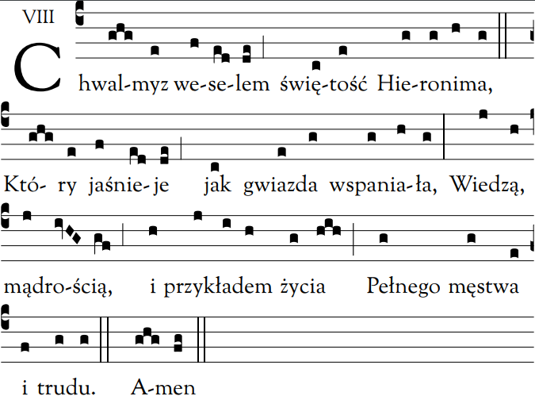

import makeLayout from "../../layouts/content";
export const layout = makeLayout();

# Nieszpory

<Opening />

<Hymn>

Wiarę zawartą w słowie objawionym
Zgłębiał wytrwale, by innych jej uczyć;
Wrogie napaści karcił gromką mową,
Do lwa gniewnego podobny.

Z wielkim zapałem i ciągłym wysiłkiem
Pisma świętego poznawał tajniki;
Nim umocniony wszystkich sycił hojnie
Ożywczej łaski pokarmem.

Wierny pragnieniu cichej samotności,
Osiadł, czuwając przy żłóbku Chrystusa;
Tam kiełznał ciało srogim umartwieniem,
By Ojcu złożyć się w darze.

Boże najlepszy, daj nam za przyczyną
Nauczyciela tak bardzo sławnego
Kroczyć drogami, które Ty wskazałeś,
I Ciebie wielbić na wieki. Amen.

</Hymn>

<Psalm
  no="116A"
  antiphon="Uchroń, Panie, moją duszę od śmierci, * a nogi od upadku."
  tone={1}
>

Miłuję Pana, albowiem usłyszał \*
głos mego błagania.

Bo skłonił ku mnie swe ucho \*
w dniu, w którym wołałem.

Oplotły mnie więzy śmierci, †
dosięgły mnie pęta Otchłani, \*
ogarnął mnie strach i udręka.

Ale wezwałem imienia Pana: \*
"Panie, ratuj moje życie!"

Pan jest łaskawy i sprawiedliwy, \*
Bóg nasz jest miłosierny.

Pan strzeże ludzi prostego serca: \*
byłem w niedoli, a On mnie wybawił.

Wróć, duszo moja, do swego spokoju, \*
bo Pan dobro ci wyświadczył.

Uchronił bowiem moją duszę od śmierci, \*
oczy od łez, nogi od upadku.

Będę chodził w obecności Pana \*
w krainie żyjących.

Chwała Ojcu i Synowi, \*
i Duchowi Świętemu.

Jak była na początku, teraz i zawsze, \*
i na wieki wieków. Amen.

</Psalm>

<Psalm
  no="121"
  antiphon="Pomoc moja od Pana, * który stworzył niebo i ziemię."
  tone={8}
>

Wznoszę swe oczy ku górom: \*
skąd nadejść ma dla mnie pomoc?

Pomoc moja od Pana, \*
który stworzył niebo i ziemię.

On nie pozwoli, by potknęła się twa noga, \*
ani się nie zdrzemnie Ten, który ciebie strzeże.

Nie zdrzemnie się ani nie zaśnie \*
Ten, który czuwa nad Izraelem.

Pan ciebie strzeże, †
jest cieniem nad tobą, \*
stoi po twojej prawicy.

We dnie nie porazi cię słońce \*
ani księżyc wśród nocy.

Pan cię uchroni od zła wszelkiego, \*
ochroni twoją duszę.

Pan będzie czuwał †
nad twoim wyjściem i powrotem, \*
teraz i po wszystkie czasy.

Chwała Ojcu i Synowi, \*
i Duchowi Świętemu.

Jak była na początku, teraz i zawsze, \*
i na wieki wieków. Amen.

</Psalm>

<Canticle
  src="1 J 1, 5b. 7. 9; 2, 1b-2"
  antiphon="Jezus Chrystus jest ofiarą przebłagalną * za grzechy całego świata."
  tone={8}
>

Bóg jest światłością \*
i nie ma w Nim żadnej ciemności.

Jeśli chodzimy w światłości, †
tak jak On sam trwa w świetle, \*
wtedy jesteśmy we wspólnocie jedni z drugimi,

A krew Jezusa, Jego Syna, \*
oczyszcza nas z wszelkiego grzechu.

Jeżeli wyznajemy nasze grzechy, †
Bóg jako wierny i sprawiedliwy nam je odpuści \*
i oczyści nas z wszelkiej nieprawości.

Jeśliby nawet ktoś zgrzeszył, †
mamy Obrońcę wobec Ojca, \*
Jezusa Chrystusa sprawiedliwego.

On bowiem jest ofiarą przebłagalną za nasze grzechy, †
i nie tylko za nasze, \*
lecz również za grzechy całego świata.

Chwała Ojcu i Synowi, \*
i Duchowi Świętemu.

Jak była na początku, teraz i zawsze, \*
i na wieki wieków. Amen.

</Canticle>

<Reading src="Jk 3, 17-18">
  Mądrość zstępująca z góry jest przede wszystkim czysta,
  dalej, skłonna do zgody, ustępliwa, posłuszna, pełna miłosierdzia i dobrych owoców,
  wolna od względów ludzkich i obłudy.
  Owoc zaś sprawiedliwości sieją w pokoju ci, którzy zaprowadzają pokój.
</Reading>

<Responsory
  a="Bóg otworzył jego usta"
  b="W pośrodku Kościoła."
  c="Napełnił go duchem wiedzy i mądrości."
/>

<Magnificat
  antiphon="Święty Hieronimie, * znakomity nauczycielu wiary, światło Kościoła, / miłośniku Bożego prawa, / módl się za nami do Jezusa Chrystusa."
  tone={7}
/>

<Intercessions response="Zachowaj lud swój, o Panie.">

Chrystus został ustanowiony Najwyższym Kapłanem dla ludzi w tym, co należy do Boga.
Uwielbiajmy Go i zanośmy do Niego pokorne błagania:

Panie, Ty wsławiłeś swój Kościół przez świętych i godnych podziwu pasterzy - spraw, aby chrześcijanie mogli się zawsze chlubić ich świętością.

Panie, Ty odpuszczałeś grzechy ludu, gdy święci pasterze, jak Mojżesz, modlili się do Ciebie, - przez ich wstawiennictwo nieustannie oczyszczaj i uświęcaj swój Kościół.

Panie, Ty wybrałeś świętych pasterzy spośród braci i zesłałeś na nich Twojego Ducha - napełnij Duchem Świętym wszystkich pasterzy swego ludu.

Panie, Ty sam jesteś wiecznym dziedzictwem świętych pasterzy - spraw, aby żaden człowiek, Krwią Twoją odkupiony, nie pozostawał z dala od Ciebie.

Panie, Ty przez pasterzy Kościoła dajesz swym owcom życie wieczne, aby nikt ich nie wyrwał z Twej ręki - wybaw zmarłych, za których oddałeś swoje życie.

</Intercessions>

<Prayer>
  Boże, Ty dałeś świętemu Hieronimowi żywe i głębokie umiłowanie Pisma świętego,
  † spraw, aby Twój lud obficie karmił się Twoim słowem * i znajdował w nim źródło życia.
  Przez naszego Pana Jezusa Chrystusa, Twojego Syna, †
  który z Tobą żyje i króluje w jedności Ducha Świętego, *
  Bóg, przez wszystkie wieki wieków. Amen.
</Prayer>

<Dismissal />
