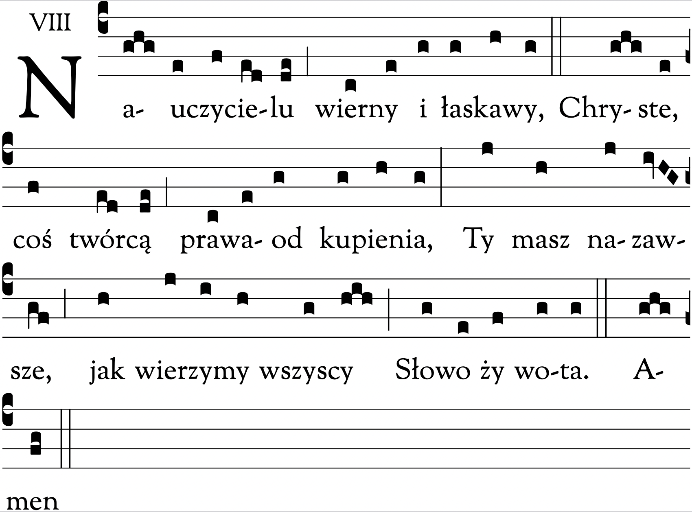

import makeLayout from "../../layouts/content";
export const layout = makeLayout();

# Jutrznia

<Opening />

<Hymn>

Już jedno z Panem stanowisz
I tobą cieszy się niebo,
Bo zasłużyłaś przez czystość,
By Oblubieniec cię wybrał.

A teraz ukaż nam drogę,
Modlitwą broń nas od złego
I pomóż mężnie odpierać
Przebiegłe ciosy szatana.

Maryja, Matka Jezusa,
Dziewiczej przykład miłości,
Niech się przyczynia za nami
I ulży doli wygnańców.

Niech Bogu w Trójcy jednemu
Na wieki będzie podzięka
Za serca wierne i czyste,
Żyjące tylko dla Niego. Amen.

</Hymn>

<Psalm
  no="63"
  antiphon="Wysławiam Chrystusa * żarliwym sercem Jego oczekuję, / Przez całą wieczność pragnę z Nim przebywać."
  tone={5}
>

Boże, mój Boże, szukam Ciebie \*
i pragnie Ciebie moja dusza.

Ciało moje tęskni za Tobą, \*
jak zeschła ziemia łaknąca wody.

Oto wpatruję się w Ciebie w świątyni, \*
by ujrzeć Twą potęgę i chwałę.

Twoja łaska jest cenniejsza od życia, \*
więc sławić Cię będą moje wargi.

Będę Cię wielbił przez całe me życie \*
i wzniosę ręce w imię Twoje.

Moja dusza syci się obficie, \*
a usta Cię wielbią radosnymi wargami,

Gdy myślę o Tobie na moim posłaniu \*
i o Tobie rozważam w czasie moich czuwań.

Bo stałeś się dla mnie pomocą \*
i w cieniu Twych skrzydeł wołam radośnie:

"Do Ciebie lgnie moja dusza, \*
prawica Twoja mnie wspiera".

Chwała Ojcu i Synowi, \*
i Duchowi Świętemu.

Jak była na początku, teraz i zawsze, \*
i na wieki wieków. Amen.

</Psalm>

<Canticle
  src="Dn 3, 57-88. 56"
  antiphon="Błogosławcie Pana dziewice, * bo Ten, który wzywa do czystej miłości, / już w was wieńczy swoje własne dary."
  noGloria
  tone={5}
>

Błogosławcie Pana, wszystkie dzieła Pańskie, \*
chwalcie Go i wywyższajcie na wieki.

Błogosławcie Pana, aniołowie Pańscy, \*
błogosławcie Pana, niebiosa.

Błogosławcie Pana, wszelkie wody podniebne, \*
błogosławcie Pana, wszystkie potęgi.

Błogosławcie Pana, słońce i księżycu, \*
błogosławcie Pana, gwiazdy na niebie.

Błogosławcie Pana, deszcze i rosy, \*
błogosławcie Pana, wszystkie wichry niebieskie.

Błogosławcie Pana, ogniu i żarze, \*
błogosławcie Pana, upale i chłodzie.

Błogosławcie Pana, rosy i szrony, \*
błogosławcie Pana, mrozy i zimna.

Błogosławcie Pana, lody i śniegi, \*
błogosławcie Pana, dnie i noce.

Błogosławcie Pana, światło i ciemności, \*
błogosławcie Pana, błyskawice i chmury.

Niech ziemia błogosławi Pana, \*
niech Go chwali i wywyższa na wieki.

Błogosławcie Pana, góry i pagórki, \*
błogosławcie Pana, wszelkie rośliny na ziemi.

Błogosławcie Pana, źródła wodne, \*
błogosławcie Pana, morza i rzeki.

Błogosławcie Pana, wieloryby i morskie stworzenia, \*
błogosławcie Pana, wszelkie ptaki powietrzne.

Błogosławcie Pana, dzikie zwierzęta i trzody, \*
błogosławcie Pana, synowie ludzcy.

Błogosław Pana, Izraelu, \*
chwal Go i wywyższaj na wieki.

Błogosławcie Pana, kapłani Pańscy, \*
błogosławcie Pana, słudzy Pańscy.

Błogosławcie Pana, duchy i dusze sprawiedliwych, \*
błogosławcie Pana, święci i pokornego serca.

Błogosławcie Pana, Chananiaszu, Azariaszu i Miszaelu, \*
chwalcie Go i wywyższajcie na wieki.

Błogosławmy Ojca i Syna, i Ducha Świętego, \*
chwalmy Go i wywyższajmy na wieki.

Błogosławiony jesteś, Panie, na sklepieniu nieba, \*
pełen chwały i wywyższony na wieki.

</Canticle>

<Psalm
  no="149"
  antiphon="Święte dziewice cieszą się w chwale, * bo nad mocami krwi i ciała / odniosły wspaniałe zwycięstwo."
  tone="1b"
>

Śpiewajcie Panu pieśń nową, \*
głoście Jego chwałę w zgromadzeniu świętych.

Niech się Izrael cieszy swoim Stwórcą, \*
a synowie Syjonu radują swym Królem.

Niech imię Jego czczą tańcem, \*
niech grają Mu na bębnie i cytrze.

Bo Pan swój lud miłuje, \*
pokornych wieńczy zwycięstwem.

Niech święci cieszą się w chwale, \*
niech się weselą przy uczcie niebieskiej.

Chwała Boża niech będzie w ich ustach, \*
a miecz obosieczny w ich ręku,

Aby pomścić się na poganach \*
i karę wymierzyć narodom,

Aby ich królów zakuć w kajdany, \*
a dostojników w żelazne łańcuchy,

Aby się spełnił wydany na nich wyrok. \*
To jest chwałą wszystkich świętych Jego.

Chwała Ojcu i Synowi, \*
i Duchowi Świętemu.

Jak była na początku, teraz i zawsze, \*
i na wieki wieków. Amen.

</Psalm>

<Reading src="PnP 8, 7">
Wody wielkie nie zdołają ugasić miłości, nie zatopią jej rzeki.
Jeśliby kto oddał za miłość całe bogactwo swego domu, pogardzą nim tylko.
</Reading>

<Responsory
  a="Szukam Ciebie, Panie,"
  b="Mówi serce moje."
  c="Będę szukać Twego oblicza."
/>

<Benedictus antiphon="Jeśli się nie odmienicie * i nie staniecie jak dzieci, / nie wejdziecie do królestwa niebieskiego." tone={5} />

{/* or 6 */}

<Intercessions response="Nagrodo dziewic, wysłuchaj nas, Panie.">

Chrystus jest Oblubieńcem i nagrodą dziewic.
Uwielbiajmy Go z radością i wołajmy do Niego:

Chryste, Ciebie święte dziewice umiłowały jako jedynago Oblubieńca - spraw, aby nic nas nie odłączyło od Twojej miłości.

Ty ukoronowałeś swą Matkę, Maryję, na Królową dziewic - spraw za Jej wstawiennictwem, abyśmy zawsze służyli Tobie z czystym sercem.

Przez orędownictwo dziewic, które czystym i niepodzielnym sercem służyły Tobie - spraw, aby dobra tego przemijającego świata nigdy nas nie odłączyły od Ciebie.

Panie Jezu, Oblubieńcze, Twego przyjścia oczekiwały roztropne dziewice - spraw, abyśmy oczekiwali Ciebie w czujności i nadziei.

Za wstawiennictwem świętej Teresy od Dzieciątka Jezus, która należała do mądrych i roztropnych dziewic - udziel nam niewinności życia i mądrości.

</Intercessions>

<Prayer>
  Boże, Ty otwierasz bramy swojego królestwa pokornym i małym,
  † spraw, abyśmy z ufnością wstępowali w ślady świętej Teresy od Dzieciątka Jezus *
  i za jej wstawiennictwem osiągnęli Twoją wieczną chwałę.
  Przez naszego Pana Jezusa Chrystusa, Twojego Syna, † który z Tobą
  żyje i króluje w jedności Ducha Świętego, * Bóg, przez wszystkie wieki wieków.
  Amen.
</Prayer>

<Dismissal />
