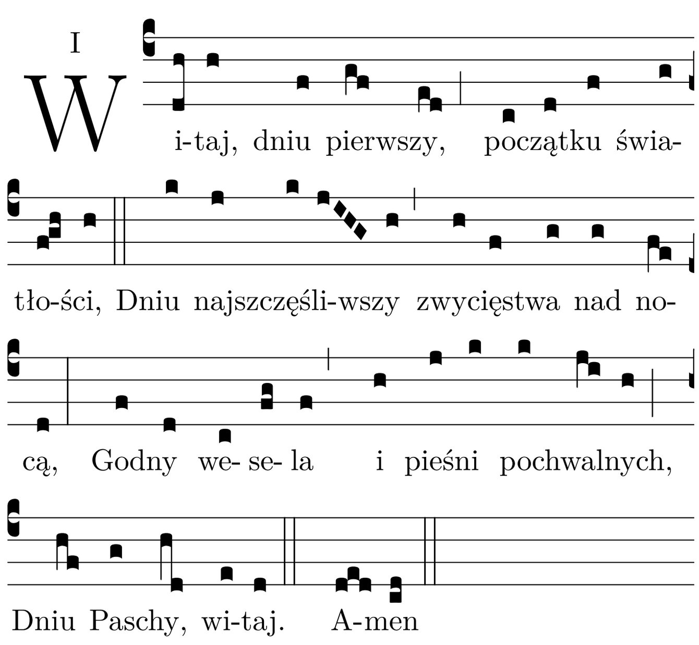

import makeLayout from "../../layouts/content";
export const layout = makeLayout();

# Jutrznia

<Opening />

<Hymn>

Nim zajaśniałeś, Jezus cierpiał za nas
I swoją męką zgładził ludzkie winy;
Pogodził z Ojcem marnotrawnych synów
Przez śmierć na krzyżu.

Razem z Chrystusem jesteśmy umarli
Złu i grzechowi, by życie odzyskać;
Chrztem odrodzeni czekamy na zorzę
Słońca wieczności.

Baranku Boży, zmartwychwstały Panie,
Zbawieni łaską, Twoją krwią obmyci,
Wielbimy Ciebie przez Twą jedność z Ojcem
W Najświętszym Duchu. Amen.

</Hymn>

<Psalm
  no="93"
  antiphon="Potężny jest Pan * w niebie. / Alleluja."
  tone={6}
>

Pan króluje, oblókł się w majestat, †
Pan wdział potęgę i nią się przepasał, \*
tak świat utwierdził, że się nie zachwieje.

Twój tron niewzruszony na wieki, \*
istniejesz od wieków, Boże.

Rzeki podnoszą się, Panie, †
rzeki swój głos podnoszą, \*
hucząc podnoszą się rzeki.

Ponad szum wód rozległych, †
od morskich fal mocniejszy \*
jest Pan potężny w niebie.

Świadectwa Twoje bardzo godne są wiary, †
Twojemu domowi świętość przystoi, \*
po wszystkie dni, o Panie.

Chwała Ojcu i Synowi, \*
i Duchowi Świętemu.

Jak była na początku, teraz i zawsze, \*
i na wieki wieków. Amen.

</Psalm>

<Canticle
  src="Dn 3, 57-88. 56"
  antiphon="Pełen chwały jesteś Panie, * i wywyższony na wieki. Alleluja."
  noGloria
  tone={6}
>

Błogosławcie Pana, wszystkie dzieła Pańskie, \*
chwalcie Go i wywyższajcie na wieki.

Błogosławcie Pana, aniołowie Pańscy, \*
błogosławcie Pana, niebiosa.

Błogosławcie Pana, wszelkie wody podniebne, \*
błogosławcie Pana, wszystkie potęgi.

Błogosławcie Pana, słońce i księżycu, \*
błogosławcie Pana, gwiazdy na niebie.

Błogosławcie Pana, deszcze i rosy, \*
błogosławcie Pana, wszystkie wichry niebieskie.

Błogosławcie Pana, ogniu i żarze, \*
błogosławcie Pana, upale i chłodzie.

Błogosławcie Pana, rosy i szrony, \*
błogosławcie Pana, mrozy i zimna.

Błogosławcie Pana, lody i śniegi, \*
błogosławcie Pana, dnie i noce.

Błogosławcie Pana, światło i ciemności, \*
błogosławcie Pana, błyskawice i chmury.

Niech ziemia błogosławi Pana, \*
niech Go chwali i wywyższa na wieki.

Błogosławcie Pana, góry i pagórki, \*
błogosławcie Pana, wszelkie rośliny na ziemi.

Błogosławcie Pana, źródła wodne, \*
błogosławcie Pana, morza i rzeki.

Błogosławcie Pana, wieloryby i morskie stworzenia, \*
błogosławcie Pana, wszelkie ptaki powietrzne.

Błogosławcie Pana, dzikie zwierzęta i trzody, \*
błogosławcie Pana, synowie ludzcy.

Błogosław Pana, Izraelu, \*
chwal Go i wywyższaj na wieki.

Błogosławcie Pana, kapłani Pańscy, \*
błogosławcie Pana, słudzy Pańscy.

Błogosławcie Pana, duchy i dusze sprawiedliwych, \*
błogosławcie Pana, święci i pokornego serca.

Błogosławcie Pana, Chananiaszu, Azariaszu i Miszaelu, \*
chwalcie Go i wywyższajcie na wieki.

Błogosławmy Ojca i Syna, i Ducha Świętego, \*
chwalmy Go i wywyższajmy na wieki.

Błogosławiony jesteś, Panie, na sklepieniu nieba, \*
pełen chwały i wywyższony na wieki.

</Canticle>

<Psalm
  no="148"
  antiphon="Chwalcie Pana * z niebios. / Alleluja."
  tone={6}
>

Chwalcie Pana z niebios, \*
† chwalcie Go na wysokościach.

Chwalcie Go, wszyscy Jego aniołowie, \*
chwalcie Go, wszystkie Jego zastępy.

Chwalcie Go, słońce i księżycu, \*
chwalcie, wszystkie gwiazdy świecące.

Chwalcie Go, nieba najwyższe \*
i wody, które są nad niebem.

Niech wychwalają imię Pana, \*
albowiem On rozkazał, i powstały.

Utwierdził je po wszystkie czasy, \*
nadał im prawo, które nie przeminie.

Chwalcie Pana na ziemi: \*
potwory morskie i wszystkie głębiny.

Ogniu i gradzie, mgło i śniegu, \*
gwałtowny huraganie, który pełnisz Jego rozkazy.

Góry i wszelkie pagórki, \*
drzewa rodzące owoc i wszystkie cedry,

Dzikie zwierzęta i wszelkie bydło, \*
płazy i ptactwo skrzydlate,

Królowie ziemscy i wszystkie narody, \*
władcy i wszyscy sędziowie tej ziemi,

Młodzieńcy i dziewczęta, \*
starcy i dzieci,

Niech imię Pana wychwalają, \*
bo tylko imię Jego jest wzniosłe.

Majestat Jego ponad ziemią i niebem \*
i On pomnaża potęgę swego ludu.

Oto pieśń pochwalna wszystkich Jego świętych, \*
synów Izraela, ludu, który jest Mu bliski.

Chwała Ojcu i Synowi, \*
i Duchowi Świętemu.

Jak była na początku, teraz i zawsze, \*
i na wieki wieków. Amen.

</Psalm>

<Reading src="Ez 37, 12b-14">
  Boże, Ty nam zesłałeś Zbawiciela i uczyniłeś nas swoimi przybranymi dziećmi,
  † wejrzyj łaskawie na wierzących w Chrystusa \*
  i obdarz ich prawdziwą wolnością i wiecznym dziedzictwem.
  Przez naszego Pana Jezusa Chrystusa, Twojego Syna, †
  który z Tobą żyje i króluje w jedności Ducha Świętego, \*
  Bóg, przez wszystkie wieki wieków. Amen.
</Reading>

<Responsory
  a="Chryste, Synu Boga żywego,"
  b="Zmiłuj się nad nami."
  c="Ty siedzisz po prawicy Ojca."
/>

<Benedictus antiphon="Pozwólcie dzieciom przychodzić do mnie, * nie przeszkadzajcie im; / do takich bowiem należy królestwo Boże." tone={5} />

<Intercessions response="Panie, bądź światłością dla swojego ludu.">

Wytrwale błagajmy Boga, który posłał Ducha Świętego,
aby był światłością serc wszystkich ludzi:

Błogosławiony jesteś, Boże, nasza światłości, - Ty dla swojej chwały pozwoliłeś nam doczekać dnia, który się rozpoczyna.

Ty opromieniłeś ziemię światłem zmartwychwstania swojego Syna, - niech Twój Kościół zaniesie to światło wszystkim ludziom.

Ty przez Ducha Świętego oświeciłeś uczniów swego Jednorodzonego Syna, - ześlij Twojego Ducha na Kościół, aby go zachował w wierności.

Światłości narodów, pamiętaj o tych, którzy trwają jeszcze w ciemnościach, - otwórz ich oczy i serca, aby poznali Ciebie, jedynego i prawdziwego Boga.

</Intercessions>

<Prayer>
  Wszechmogący, wieczny Boże, Twoja hojność przewyższa zasługi i pragnienia modlących się do Ciebie;
  † okaż nam swoje miłosierdzie, * odpuść grzechy, które niepokoją nasze sumienia,
  i udziel nam również tego, o co nie ośmielamy się prosić.
  Przez naszego Pana Jezusa Chrystusa, Twojego Syna, †
  który z Tobą żyje i króluje w jedności Ducha Świętego, *
  Bóg, przez wszystkie wieki wieków. Amen.
</Prayer>

<Dismissal />
